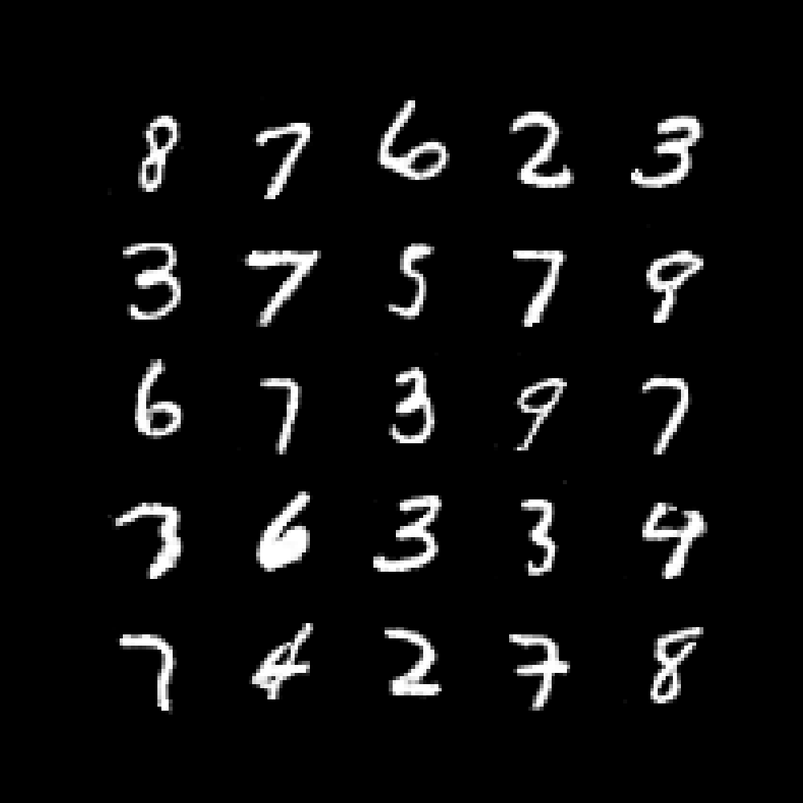

# Vision Models - Playground

## Table of Contents

- [Description](#description)
- [Install](#install)

## Models
- [YoloV1](#yolov1)
- [ResNet](#resnet)
- [Vision Transformer](#vision-transformer-vit)
- [Generative Adversarial Networks](#generative-adversarial-networks-gan)
- [Perceiver](#perceiver)
- [Vision Perceiver](#vision-perceiver-vip)
- [Convolutional Vision Transformer](#convolutional-vision-transformer-cvt)
- [UNet](#unet)

## Description

This playground is a collection of vision models implemented by me from scratch
in PyTorch, with the purpose of getting a better understanding of the specific
papers and techniques used.

## Install

In order to install this package, run the following command:

```bash
$ pip install vision-models-playground
```


## YoloV1

A detector based on the [YoloV1](https://arxiv.org/abs/1506.02640) architecture. Also known as Darknet.

### Usage

Models can be initialized with pre-build or custom versions.

Code example to initialize and use prebuild YoloV1

```python
import torch
from vision_models_playground.models.segmentation import build_yolo_v1

model = build_yolo_v1(num_classes=20, in_channels=3, grid_size=7, num_bounding_boxes=2)

img = torch.randn(1, 3, 448, 448)  # <batch_size, in_channels, height, width>
preds = model(img)  # (1, 7, 7, 30) <batch_size, grid_size, grid_size, num_classes + 5 * num_bounding_boxes>
```

Or if you want to use the custom YoloV1

```python
import torch
from vision_models_playground.models.segmentation import YoloV1

dims = [[64], [192], [128, 256, 256, 512], [256, 512, 256, 512, 256, 512, 256, 512, 512, 1024], [512, 1024, 512, 1024]]
kernel_size = [[7], [3], [1, 3, 1, 3], [1, 3, 1, 3, 1, 3, 1, 3, 1, 3], [1, 3, 1, 3]]
stride = [[2], [1], [1, 1, 1, 1], [1, 1, 1, 1, 1, 1, 1, 1, 1, 1], [1, 1, 1, 1]]
max_pools = [True, True, True, True, False]

model = YoloV1(
    dims=dims,
    kernel_size=kernel_size,
    stride=stride,
    max_pools=max_pools,

    in_channels=3,
    num_classes=20,
    num_bounding_boxes=2,
    grid_size=7,

    mlp_size=1024,
)

img = torch.randn(1, 3, 448, 448)  # <batch_size, in_channels, height, width>
preds = model(img)  # (1, 7, 7, 30) <batch_size, grid_size, grid_size, num_classes + 5 * num_bounding_boxes>
```

### Parameters

- `dims`: List[List[int]].  
The number of channels in each layer.


- `kernel_size`: List[List[int]].  
The kernel size in each layer.


- `stride`: List[List[int]].  
The stride in each layer.


- `max_pools`: List[bool].  
If enabled, a max pool layer is applied after the convolutional layer.


- `in_channels`: int.  
The number of channels in the input image.


- `num_classes`: int.  
The number of classes to classify.


- `num_bounding_boxes`: int.  
The number of bounding boxes to predict per grid cell.


- `grid_size`: int.  
The size of the grid that the image is split into.


- `mlp_size`: int.  
The size of the MLP layer that is applied after the convolutional layers.


### PreTrained Weights

If you want to use the pretrained weights, you use the following code:

```py
import torch
from vision_models_playground.utility.hub import load_vmp_model_from_hub


model = load_vmp_model_from_hub("Akriel/ResNetYoloV1")

img = torch.randn(1, 3, 448, 448)  # <batch_size, in_channels, height, width>
preds = model(img)  # (1, 7, 7, 30) <batch_size, grid_size, grid_size, num_classes + 5 * num_bounding_boxes>
```

If you want to use the pretrained model within a pipeline on raw images, you can use the following code:

```py
from PIL import Image

from vision_models_playground.utility.hub import load_vmp_pipeline_from_hub

pipeline = load_vmp_pipeline_from_hub("Akriel/ResNetYoloV1")

# Load image
x = Image.open("path/to/image.jpg")
y = pipeline(x)  # A dictionary containing the predictions
```

For more information about the pretrain models, check the [hub](https://huggingface.co/Akriel/ResNetYoloV1) page.  
Or check the demo results from `explore_models/yolo_trained_model.ipynb`

## ResNet

A classifier based on the [ResNet](https://arxiv.org/abs/1512.03385) architecture.

### Usage

Models can be initialized with pre-build or custom versions.

Pre-build models:

- ResNet18
- ResNet34
- ResNet50
- ResNet101
- ResNet152

Code example to initialize and use prebuild ResNet34

```python
import torch
from vision_models_playground.models.classifiers import build_resnet_34

model = build_resnet_34(num_classes=10, in_channels=3)

img = torch.randn(1, 3, 256, 256)  # <batch_size, in_channels, height, width>
preds = model(img)  # (1, 10) <batch_size, num_classes>
```

Code example to initialize ResNet34 using the custom ResNet

```python
import torch
from vision_models_playground.models.classifiers import ResNet
from vision_models_playground.components.convolutions import ResidualBlock

model = ResNet(
    in_channels=3,
    num_classes=10,
    num_layers=[3, 4, 6, 3],
    num_channels=[64, 128, 256, 512],
    block=ResidualBlock
)

img = torch.randn(1, 3, 256, 256)  # <batch_size, in_channels, height, width>
preds = model(img)  # (1, 10) <batch_size, num_classes>
```


### Parameters

- `in_channels`: int.  
The number of channels in the input image.


- `num_classes`: int.  
The number of predicted classes


- `num_layers`: List[int]  
The number of block layers in each stage.


- `num_channels`: List[int]  
The number of channels in each stage.  
Each stage will start with a stride of 2, connecting the previous stage channels 
with the current stage channels.


- `block`: Union[ResidualBlock, BottleneckBlock]  
The block type used.  
There are two pre-implemented block types: ResidualBlock and BottleneckBlock.  
Can be replaced with any custom block that has the following params in the constructor:
`in_channels`, `out_channels`, `stride`.

## Vision Transformer (ViT)

A classifier based on the [Vision Transformer](https://openreview.net/pdf?id=YicbFdNTTy) 
architecture.

### Usage

Code example to initialize and use Vision Transformer

```python
import torch
from vision_models_playground.models.classifiers import VisionTransformer

model = VisionTransformer(
    image_size=256,
    patch_size=32,
    num_classes=1000,
    projection_dim=1024,
    depth=6,
    heads=16,
    mlp_dim=2048,
    dropout=0.1,
    emb_dropout=0.1,
    apply_rotary_emb=True,
)

img = torch.randn(1, 3, 256, 256)
preds = model(img)  # (1, 1000)
```

### Parameters

- `image_size`: int.  
Image size. If you have rectangular images, make sure your image size is the maximum of the width and height


- `patch_size`: int.  
Number of patches. `image_size` must be divisible by `patch_size`.  
The number of patches is: ` n = (image_size // patch_size) ** 2` and `n` **must be greater than 16**.


- `num_classes`: int.  
Number of classes to classify.


- `projection_dim`: int.  
Last dimension of output tensor after linear transformation `nn.Linear(..., dim)`.


- `depth`: int.  
Number of Transformer blocks.


- `heads`: int.  
Number of heads in Multi-head Attention layer. 


- `mlp_dim`: int.  
Dimension of the MLP (FeedForward) layer. 


- `channels`: int, default `3`.  
Number of image's channels. 


- `dropout`: float between `[0, 1]`, default `0`.  
Dropout rate. 


- `emb_dropout`: float between `[0, 1]`, default `0`.   
Embedding dropout rate.


- `dim_head`: int, default to `64`.  
The dim for each head for Multi-Head Attention.


- `pool`: string, either `cls` or `mean`, default to `mean`  
Determines if token pooling or mean pooling is applied


- `apply_rotary_emb`: bool, default `False`.  
If enabled, applies rotary_embedding in Attention blocks.

## Generative Adversarial Networks (GAN)

A generative model based on the [GAN](https://arxiv.org/abs/1406.2661) architecture.

### Usage

Since the generated images must have a certain shape, the GAN model receives
both the Generator and the Discriminator as input.

The GAN is taking care of the training process, by computing the loss and
updating the weights of the Generator and Discriminator.

Here is a code example that shows how to use the GAN interface to train on the
MNIST dataset.

```python
import torch

from torchvision import datasets, transforms

from vision_models_playground.models.generative import GAN

# Import custom Generator and Discriminator adequate to the problem
from vision_models_playground.models.generative.adverserial.gan import Discriminator
from vision_models_playground.models.generative.adverserial.gan import Generator

# Create GAN
generator = Generator()
discriminator = Discriminator()
gan = GAN(generator, discriminator)

# Put model on cuda
gan.cuda()

# Create the data loader
train_loader = torch.utils.data.DataLoader(
    datasets.MNIST('./data', train=True, download=True, transform=transforms.Compose([
        transforms.ToTensor(),
    ])),
    batch_size=64,
    shuffle=True
)

# Train the GAN
gan.train_epochs(train_loader, epochs=100, print_every=100)
```

### Parameters

- `generator`: nn.Module  
The Generator model.  
Must have self.noise_dim set to the dimension of the noise vector used by the 
Generator in the forward step.


- `discriminator`: nn.Module  
The Discriminator model.
The output of the Discriminator must have shape (<batch_size, 1), having the
probability of the image being real.

### Results

This is a sample of the results of the GAN on MNIST.  

</img>

For reference, this is a sample of the original MNIST dataset.  

</img>

### Known issues

At this moment, the gan is coded to operate only on CUDA devices.
In future the code will be refactored to allow the use of CPU devices too.

## Perceiver

A classifier based on the [Perceiver](https://arxiv.org/abs/2103.03206) 
architecture.

### Usage

Code example to initialize and use Perceiver

```python
import torch
from vision_models_playground.models.classifiers import Perceiver

model = Perceiver(
    input_dim=3,
    input_axis=2,
    final_classifier_head=True,
    num_classes=1000,
    apply_rotary_emb=True,
    apply_fourier_encoding=True,
    max_freq=10,
    num_freq_bands=6,
    constant_mapping=False,
    max_position=1600,
    num_layers=4,
    num_latents=16,
    latent_dim=32,
    cross_num_heads=4,
    cross_head_dim=32,
    self_attend_heads=4,
    self_attend_dim=32,
    transformer_depth=2,
    attention_dropout=0.,
    ff_hidden_dim=64,
    ff_dropout=0.,
    activation=None,
)

img = torch.randn(1, 256, 256, 3)
preds = model(img)  # (1, 1000)
```

### Parameters

- `input_dim`: int.  
Number of channels of the input.


- `input_axis`: int.  
Number of axis of the input.  
If the input is a sequence, the input_axis is 1  
If the input is an image, the input_axis is 2.  
If the input is a video, the input_axis is 3.  


- `final_classifier_head`: bool.  
If enabled, the final classifier head is applied, and logits are returned.  
If disabled, the final classifier head is not applied, and latents are returned.


- `num_classes`: int.  
Number of classes to classify.


- `apply_rotary_emb`: bool.  
If enabled, applies rotary_embedding in Attention blocks.


- `apply_fourier_encoding`: bool.  
If enabled, applies fourier_encoding over the input


- `max_freq`: int.  
Maximum frequency to be used in fourier_encoding.


- `num_freq_bands`: int.  
Number of frequency bands to be used in fourier_encoding.


- `constant_mapping`: bool.
If enabled, uses a constant mapping for the axis of the fourier_encoding.


- `max_position`: int.  
Maximum position to be used in the positional fourier encoding.  
Works only if `constant_mapping` is enabled.


- `num_layers`: int.  
Number of layers


- `num_latents`: int.  
Number of latents


- `latent_dim`: int.  
Dimension of the latent vector


- `cross_num_heads`: int.  
Number of heads in the cross attention blocks


- `cross_head_dim`: int.  
Dimension of the heads in the cross attention blocks


- `self_attend_heads`: int.  
Number of heads in the self attention blocks


- `self_attend_dim`: int.  
Dimension of the heads in the self attention blocks


- `transformer_depth`: int.  
Number of layers in the transformer


- `attention_dropout`: float.  
Dropout probability for the attention layers


- `ff_hidden_dim`: int.  
Dimension of the hidden layers in the feed forward blocks


- `ff_dropout`: float.  
Dropout probability for the feed forward layers


- `activation`: Callable.  
Activation function to be used in the feed forward blocks.  
If left as None, GEGLU is used.


## Vision Perceiver (ViP)

A classifier based on the [Perceiver](https://arxiv.org/abs/2103.03206) architecture, 
but adapted to work with the technique of the 
[Vision Transformer](https://openreview.net/pdf?id=YicbFdNTTy) by splitting the
image into patches, and projecting them into a sequence.

### Usage

Code example to initialize and use Vision Perceiver

```python
import torch
from vision_models_playground.models.classifiers import VisionPerceiver

model = VisionPerceiver(
    patch_size=4,
    projection_dim=1024,
    num_classes=1000,
    apply_rotary_emb=True,
    max_position=1600,
    num_layers=2,
    num_latents=16,
    latent_dim=32,
    cross_num_heads=8,
    cross_head_dim=64,
    self_attend_heads=8,
    self_attend_dim=64,
    transformer_depth=2,
    attention_dropout=0.0,
    ff_hidden_dim=512,
    ff_dropout=0.0,
    activation=None,
)

img = torch.randn(1, 256, 256, 3)
preds = model(img)  # (1, 1000)
```

### Parameters

- `patch_size`: int.  
Size of the patches the image is split into.


- `projection_dim`: int.  
Dimension of the projection layer.


- `num_classes`: int.  
Number of classes to classify.


- `apply_rotary_emb`: bool.  
If enabled, applies rotary_embedding in Attention blocks.


- `apply_fourier_encoding`: bool.  
If enabled, applies fourier_encoding over the input


- `max_freq`: int.  
Maximum frequency to be used in fourier_encoding.


- `num_freq_bands`: int.  
Number of frequency bands to be used in fourier_encoding.


- `constant_mapping`: bool, default `False`.  
If enabled, uses a constant mapping for the axis of the fourier_encoding.


- `max_position`: int.  
Maximum position to be used in the positional fourier encoding.  
Works only if `constant_mapping` is enabled.


- `num_layers`: int.  
Number of layers


- `num_latents`: int.  
Number of latents


- `latent_dim`: int.  
Dimension of the latent vector


- `cross_num_heads`: int.  
Number of heads in the cross attention blocks


- `cross_head_dim`: int.  
Dimension of the heads in the cross attention blocks


- `self_attend_heads`: int.  
Number of heads in the self attention blocks


- `self_attend_dim`: int.  
Dimension of the heads in the self attention blocks


- `transformer_depth`: int.  
Number of layers in the transformer


- `attention_dropout`: float.  
Dropout probability for the attention layers


- `ff_hidden_dim`: int.  
Dimension of the hidden layers in the feed forward blocks


- `ff_dropout`: float.  
Dropout probability for the feed forward layers


- `activation`: callable.  
Activation function to be used in the feed forward blocks.  
If left as None, GEGLU is used.


## Convolutional Vision Transformer (CvT)

A classifier based on the 
[Convolutional Vision Transformer](https://arxiv.org/abs/2103.15808) 
architecture.

### Usage

Models can be initialized with pre-build or custom versions.

Pre-build models:

- CvT13
- CvT21
- CvTW24

Code example to initialize and use prebuild CvT13

```python
import torch
from vision_models_playground.models.classifiers import build_cvt_13

model = build_cvt_13(num_classes=1000, in_channels=3)

img = torch.randn(1, 256, 256, 3)
preds = model(img)  # (1, 1000)
```

Code example to initialize CvT13 using the custom Convolutional Vision Transformer

```python
import torch
from vision_models_playground.models.classifiers import ConvVisionTransformer

model = ConvVisionTransformer(
    in_channels=3,
    num_classes=1000,
    patch_size=[7, 3, 3],
    patch_stride=[4, 2, 2],
    patch_padding=[2, 1, 1],
    embedding_dim=[64, 192, 384],
    depth=[1, 2, 10],
    num_heads=[1, 3, 6],
    ff_hidden_dim=[256, 768, 1536],
    qkv_bias=[True, True, True],
    drop_rate=[0.0, 0.0, 0.0],
    attn_drop_rate=[0.0, 0.0, 0.0],
    drop_path_rate=[0.0, 0.0, 0.1],
    kernel_size=[3, 3, 3],
    stride_kv=[2, 2, 2],
    stride_q=[1, 1, 1],
    padding_kv=[1, 1, 1],
    padding_q=[1, 1, 1],
    method=['conv', 'conv', 'conv'],
)

img = torch.randn(1, 256, 256, 3)
preds = model(img)  # (1, 1000)
```

### Parameters

- `in_channels`: int.  
Number of input channels.


- `num_classes`: int.  
Number of classes to classify.


- `activation`: callable.  
Activation function to be used in the feed forward blocks.  
If left as None, QuickGELU is used.


- `final_classifier_head`: bool.  
If enabled, uses a final classifier head.  
If disabled, returns the image features.


- `patch_size`: List[int].  
Size of the patches the image is split into, per each Vision Transformer layer.
The patches can overlap


- `patch_stride`: List[int].  
Stride of the patches, per each Vision Transformer layer.


- `patch_padding`: List[int].  
Padding of the patches, per each Vision Transformer layer.


- `embedding_dim`: List[int].  
Dimension of the embedding layers, per each Vision Transformer layer.


- `depth`: List[int].  
The depth of each Vision Transformer layer.


- `num_heads`: List[int].  
The number of heads in each Attention block, per each Vision Transformer layer.


- `ff_hidden_dim`: List[int].  
Dimension of the hidden layers in the feed forward blocks, 
per each Vision Transformer layer.


- `qkv_bias`: List[bool].  
If enabled, adds a bias to the query, key and value vectors,
per each Vision Transformer layer.


- `drop_rate`: List[float].  
The dropout rate for the dropout layers in the Vision Transformer, 
Feed Forward and the output of the Attention layers.


- `attn_drop_rate`: List[float].  
The dropout rate for the dropout layers in the Attention layers.


- `drop_path_rate`: List[float].  
The DropPath rate for the DropPath layers, per each Vision Transformer.  
The DropPath rate that is applied inside each Attend block for the residual
connections is computed dynamically based on the depth of the Vision Transformer.


- `kernel_size`: List[int].  
The kernel size of the convolutional layers, per each Vision Transformer layer.


- `stride_kv`: List[int].  
The stride of the convolutional layers, used in the projection of the Keys and Values.


- `stride_q`: List[int].  
The stride of the convolutional layers, used in the projection of the Queries.


- `padding_kv`: List[int].  
The padding of the convolutional layers, used in the projection of the Keys and Values.


- `padding_q`: List[int].  
The padding of the convolutional layers, used in the projection of the Queries.


- `method`: List[Literal['conv', 'avg', 'linear']].  
The method of computing the projections of the Keys, Values and Queries.  
`conv` stand for convolutional normalized layer, followed by linear projection  
`avg` stands for average pool layer, followed by linear projection  
`linear` stands for linear projection.

## UNet

A pixel-level classifier based on the 
[UNet](https://arxiv.org/abs/1505.04597v1) 
architecture.

### Usage

Code example to initialize and use UNet

```python
import torch
from vision_models_playground.models.segmentation import UNet

model = UNet(
    in_channels=1,
    out_channels=2,
    channels=[64, 128, 256, 512, 1024],
    pooling_type="max",
    scale=2,
    conv_kernel_size=3,
    conv_padding=0,
    method="conv",
    crop=True
)
x = torch.randn(1, 1, 572, 572)
y = model(x)  # (1, 2, 388, 388)
```

### Parameters

- `in_channels`: int.  
Number of input channels.


- `out_channels`: int.  
Number of output channels.  
Can be used as number of classes per pixel.  
In case of segmentation, the number of classes can be 2 for example.


- `channels`: List[int].  
List of the number of channels in each layer.


- `pooling_type`: Literal['max', 'avg'].  
Type of pooling to be used for the DownScale layers


- `scale`: int.  
Scale of the image for each stage.


- `conv_kernel_size`: int.  
Kernel size of the convolutional layers.


- `conv_padding`: int.  
Padding of the convolutional layers.


- `method`: Literal["nearest", "linear", "bilinear", "bicubic", "trilinear", "conv"].  
Method of computing the initial upscale of the image.
If `conv` is selected, uses a convolutional transposed layer.
Else, uses a `nn.functional.upsample` function with the corresponding method.


- `crop`: bool.  
If enabled, the output each upscale layer will be cropped to the native size
of the UpScaled image.

